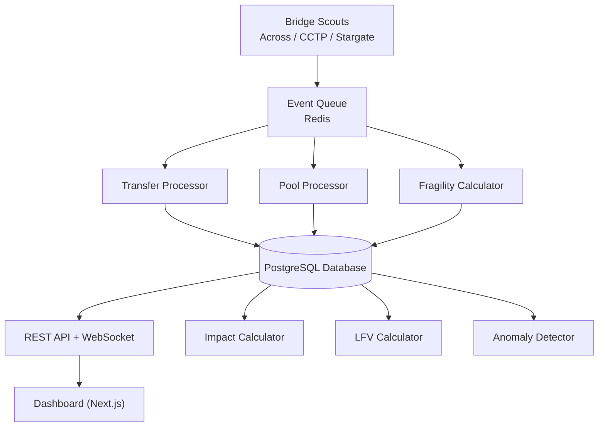

# Corridor Scouts

> Real-time cross-chain bridge monitoring and corridor health analytics

[](https://github.com/your-org/corridor-scouts)
[](LICENSE)

---

## About

Corridor Scouts is a public dashboard and data infrastructure for monitoring cross-chain bridge health in real-time. The system tracks transfer flows, settlement times, and liquidity dynamics across major DeFi bridges including Across, CCTP, Stargate, and others.

**Key Features:**
- **Corridor Health Monitoring** - Real-time status tracking for bridge routes
- **Liquidity Flight Velocity** - Track how fast capital moves between chains
- **Transfer Analytics** - Settlement times, success rates, and anomaly detection
- **Fragility Scoring** - Assess corridor stability and utilization
- **Impact Preview** - Estimate liquidity impact before large transfers

**What We're Building:**
- Public dashboard exposing corridor health metrics
- WebSocket support for real-time updates
- Data collection infrastructure for future structural DeFi metrics

---

## High Level System Architecture


## Tech Stack

- **Frontend:** Next.js 15, React 18, Tailwind CSS
- **Backend:** Next.js API Routes, WebSocket
- **Database:** PostgreSQL (Prisma ORM)
- **Cache:** Redis
- **Event Processing:** Custom bridge scouts + event queue
- **Chain Interaction:** ethers.js with multi-chain RPC support

---

## Local Development

### Prerequisites

- Node.js 18+
- Docker & Docker Compose
- Git

### Setup

1. **Install dependencies**
   ```bash
   npm install
   ```

2. **Configure environment**
   ```bash
   cp .env.example .env.local
   # Edit .env.local with your configuration
   ```

3. **Start services**
   ```bash
   # Start PostgreSQL and Redis
   docker-compose up -d
   
   # View database logs (optional)
   docker-compose logs -f postgres
   ```

4. **Run database migrations**
   ```bash
   # Apply schema migrations
   npx prisma migrate dev
   
   # Validate schema
   npx prisma validate
   ```

5. **Start development server**
   ```bash
   npm run dev
   ```

The dashboard will be available at `http://localhost:3000`.

---

## Database Management

### View Database
```bash
npx prisma studio
```

### Apply Migrations
```bash
npx prisma migrate dev
```

### Performance Optimization (Optional)
Apply partial indexes for better query performance on large datasets:
```bash
docker exec -i corridor-postgres psql -U postgres -d corridor_scouts < prisma/migrations/0001_partial_indexes/migration.sql
```

### Teardown
```bash
# Stop containers (keeps data)
docker-compose down

# Stop containers and remove volumes (deletes all data)
docker-compose down -v
```

---

## Documentation

- [System Specification](docs/SYSTEM-SPEC.md) - Full technical specification
- [API Documentation](docs/API-SPEC.md) - API endpoints and usage
- [Architecture Diagrams](docs/ARCHITECTURE-DIAGRAMS.md) - System architecture
- [Product Requirements Document](docs/PRD.md)

---

## License

MIT License - see [LICENSE](LICENSE) for details

---

## Status

🚧 **Under Active Development** - This project is in early development. Expect breaking changes and incomplete features.

