# Architecture Diagrams
## Corridor Scout - Visual Documentation

This file contains Mermaid diagrams for the Corridor Scout system. Render these in any Mermaid-compatible viewer.

---

## 1. System Context Diagram

---

## 2. Data Flow Sequence

---

## 3. Component Architecture

---

## 4. Database Entity Relationship

---

## 5. Transfer State Machine

---

## 6. Health Status Decision Tree

```mermaid
flowchart TD
    Start([Evaluate Corridor Health]) --> A{Success Rate 1h}
    
    A -->|< 95%| Down[🔴 DOWN]
    A -->|95-99%| B{Latency Check}
    A -->|≥ 99%| C{Latency Check}
    
    B -->|> 5x normal| Down
    B -->|2-5x normal| Degraded[🟡 DEGRADED]
    B -->|≤ 2x normal| Degraded
    
    C -->|> 5x normal| Down
    C -->|2-5x normal| Degraded
    C -->|≤ 2x normal| D{Transfer Volume}
    
    D -->|No transfers 1h| Degraded
    D -->|Has transfers| Healthy[🟢 HEALTHY]

    style Down fill:#ffcdd2
    style Degraded fill:#fff9c4
    style Healthy fill:#c8e6c9
```

---

## 7. Fragility Calculation Flow

---

## 8. LFV Interpretation Scale

```mermaid
flowchart LR
    subgraph Scale["Liquidity Flight Velocity Scale"]
        RF["🔴 Rapid Flight
        LFV < -10%"]
        MO["🟠 Moderate Outflow
        -10% ≤ LFV < -3%"]
        ST["🟢 Stable
        -3% ≤ LFV < 3%"]
        MI["🔵 Moderate Inflow
        3% ≤ LFV < 10%"]
        RI["🟣 Rapid Inflow
        LFV ≥ 10%"]
    end

    RF --- MO --- ST --- MI --- RI

    style RF fill:#ffcdd2
    style MO fill:#ffe0b2
    style ST fill:#c8e6c9
    style MI fill:#bbdefb
    style RI fill:#e1bee7
```

---

## 9. API Request Flow

---

## 10. Deployment Architecture

---

## 11. Dashboard Component Tree

---

## 12. Weekly Build Timeline

