# System Specification
## Corridor Scout - Technical Architecture

**Version:** 1.0  
**Date:** February 2026

---

## 1. System Overview

### 1.1 High-Level Architecture

```mermaid
flowchart TB
    subgraph External["EXTERNAL CHAINS"]
        ETH[Ethereum]
        ARB[Arbitrum]
        OPT[Optimism]
        BASE[Base]
    end

    subgraph System["CORRIDOR SCOUT SYSTEM"]
        subgraph Ingestion["DATA INGESTION LAYER"]
            AS[Across Scout<br/>ETH, ARB, OPT, BASE, POLY]
            CS[CCTP Scout<br/>ETH, ARB, OPT, BASE, AVAX]
            SS[Stargate Scout<br/>ETH, ARB, OPT, AVAX, POLY]
        end

        subgraph Queue["EVENT QUEUE"]
            Redis[(Redis<br/>• transfer:init<br/>• transfer:complete<br/>• pool:snapshot)]
        end

        subgraph Processing["PROCESSING LAYER"]
            TP[Transfer Processor<br/>• Match initiations to completions<br/>• Calculate settlement duration<br/>• Classify by size bucket<br/>• Update transfer status]
            FC[Fragility Calculator]
            IC[Impact Calculator]
            LC[LFV Calculator]
        end

        subgraph Storage["STORAGE LAYER"]
            DB[(PostgreSQL<br/>• transfers<br/>• pool_snapshots<br/>• anomalies)]
        end

        subgraph API["API LAYER"]
            Routes[Next.js API Routes<br/>GET /api/health<br/>GET /api/flight<br/>GET /api/corridors<br/>GET /api/corridors/:id<br/>GET /api/impact/estimate<br/>GET /api/anomalies]
            WS[WebSocket Server<br/>Real-time updates]
        end

        subgraph Presentation["PRESENTATION LAYER"]
            Dashboard[Next.js Dashboard<br/>• HealthSummary<br/>• FlightVelocity<br/>• AlertList<br/>• ImpactCalculator<br/>• CorridorTable]
        end
    end

    ETH --> AS
    ARB --> AS
    OPT --> AS
    BASE --> AS
    ETH --> CS
    ARB --> CS
    OPT --> CS
    BASE --> CS
    ETH --> SS
    ARB --> SS
    OPT --> SS

    AS --> Redis
    CS --> Redis
    SS --> Redis

    Redis --> TP
    TP --> FC
    TP --> IC
    TP --> LC
    TP --> DB
    FC --> DB
    
    DB --> Routes
    Routes --> WS
    Routes --> Dashboard
    WS --> Dashboard
```



---

## 2. Data Flow Diagrams

### 2.1 Transfer Event Flow

```mermaid
sequenceDiagram
    autonumber
    participant SC as Source Chain
    participant AS as Across Scout
    participant RQ as Redis Queue
    participant TP as Transfer Processor
    participant DB as Database
    participant DC as Dest Chain
    participant AS2 as Across Scout (dest)

    Note over SC: User initiates transfer
    
    SC->>AS: V3FundsDeposited Event<br/>depositId: 12345<br/>inputToken: USDC<br/>inputAmount: 10000000000<br/>destinationChainId: 42161
    AS->>AS: Parse event data<br/>Create TransferID<br/>Normalize amounts
    AS->>RQ: Publish to transfer:initiated
    RQ->>TP: Consume event
    TP->>DB: INSERT transfer<br/>status: 'pending'
    TP->>TP: Add to pending map

    Note over SC,DC: ⏱️ Time passes (~3-5 minutes)

    DC->>AS2: FilledV3Relay Event<br/>depositId: 12345<br/>originChainId: 1<br/>relayer: 0xdef...<br/>outputAmount: 9995000000
    AS2->>RQ: Publish to transfer:completed
    RQ->>TP: Consume event
    TP->>TP: Match to pending transfer<br/>Calculate duration
    TP->>DB: UPDATE transfer<br/>completed_at: now<br/>duration: 210s<br/>status: 'completed'
```



### 2.2 Calculation Flow


---

## 3. Database Schema

### 3.1 Entity Relationship Diagram


**Indexes:**
- `transfers`: (bridge, source_chain, dest_chain, initiated_at DESC), (status) WHERE status = 'pending', (bridge, initiated_at DESC)
- `pool_snapshots`: (pool_id, recorded_at DESC), (chain, recorded_at DESC)
- `anomalies`: (corridor_id) WHERE resolved_at IS NULL, (detected_at DESC)

### 3.2 Prisma Schema

```prisma
// prisma/schema.prisma

generator client {
  provider = "prisma-client-js"
}

datasource db {
  provider = "postgresql"
  url      = env("DATABASE_URL")
}

model Transfer {
  id               BigInt    @id @default(autoincrement())
  transferId       String    @unique @map("transfer_id")
  bridge           String
  sourceChain      String    @map("source_chain")
  destChain        String    @map("dest_chain")
  asset            String
  amount           Decimal
  amountUsd        Decimal?  @map("amount_usd")
  initiatedAt      DateTime  @map("initiated_at")
  completedAt      DateTime? @map("completed_at")
  durationSeconds  Int?      @map("duration_seconds")
  status           String    @default("pending")
  txHashSource     String?   @map("tx_hash_source")
  txHashDest       String?   @map("tx_hash_dest")
  blockInitiated   BigInt?   @map("block_initiated")
  blockCompleted   BigInt?   @map("block_completed")
  gasPriceGwei     Decimal?  @map("gas_price_gwei")
  transferSizeBucket String? @map("transfer_size_bucket")
  hourOfDay        Int?      @map("hour_of_day")
  dayOfWeek        Int?      @map("day_of_week")
  createdAt        DateTime  @default(now()) @map("created_at")
  updatedAt        DateTime  @updatedAt @map("updated_at")

  @@index([bridge, sourceChain, destChain, initiatedAt(sort: Desc)], name: "idx_transfers_corridor")
  @@index([status], name: "idx_transfers_pending")
  @@index([bridge, initiatedAt(sort: Desc)], name: "idx_transfers_bridge")
  @@map("transfers")
}

model PoolSnapshot {
  id                BigInt   @id @default(autoincrement())
  poolId            String   @map("pool_id")
  bridge            String
  chain             String
  asset             String
  tvl               Decimal
  tvlUsd            Decimal? @map("tvl_usd")
  availableLiquidity Decimal? @map("available_liquidity")
  utilization       Decimal?
  recordedAt        DateTime @map("recorded_at")

  @@index([poolId, recordedAt(sort: Desc)], name: "idx_pool_snapshots_pool")
  @@index([chain, recordedAt(sort: Desc)], name: "idx_pool_snapshots_chain")
  @@map("pool_snapshots")
}

model Anomaly {
  id           BigInt    @id @default(autoincrement())
  anomalyType  String    @map("anomaly_type")
  corridorId   String    @map("corridor_id")
  bridge       String
  sourceChain  String?   @map("source_chain")
  destChain    String?   @map("dest_chain")
  severity     String
  detectedAt   DateTime  @map("detected_at")
  resolvedAt   DateTime? @map("resolved_at")
  details      Json?
  createdAt    DateTime  @default(now()) @map("created_at")

  @@index([corridorId], name: "idx_anomalies_active")
  @@index([detectedAt(sort: Desc)], name: "idx_anomalies_time")
  @@map("anomalies")
}
```

---

## 4. Component Architecture

### 4.1 Scout Component Pattern


### 4.2 API Route Structure


---

## 5. State Management

### 5.1 Client-Side Data Flow


---

## 6. Deployment Architecture


---

## 7. Error Handling Strategy


**Impact Summary:**

| Error Type | Handling | User Impact |
|------------|----------|-------------|
| RPC Timeout | Retry 3x → Fallback → Cache | None (transparent) |
| Database Error | Retry → Circuit breaker → Cache | Brief stale data |
| Missing Match | Orphan queue → Retry → Discard | None |
| API Rate Limit | Queue → Backoff | Slight delay |

---

## 8. Monitoring & Observability


---

## 9. Security Considerations

### 9.1 Attack Vectors & Mitigations

| Vector | Risk | Mitigation |
|--------|------|------------|
| DDoS | Service unavailable | Vercel edge caching, rate limiting |
| API abuse | Resource exhaustion | IP-based rate limits (100/min) |
| SQL injection | Data breach | Prisma parameterized queries |
| XSS | Data theft | React auto-escaping, CSP headers |
| Data poisoning | Wrong metrics | Validate event signatures |

### 9.2 Security Headers

```typescript
// next.config.js
const securityHeaders = [
  { key: 'X-Content-Type-Options', value: 'nosniff' },
  { key: 'X-Frame-Options', value: 'DENY' },
  { key: 'X-XSS-Protection', value: '1; mode=block' },
  { key: 'Referrer-Policy', value: 'strict-origin-when-cross-origin' },
  { key: 'Content-Security-Policy', value: "default-src 'self'; ..." }
];
```

---

## 10. Future Considerations (Post-Phase 0)

- **Authentication**: API keys for higher rate limits
- **Webhooks**: Push notifications for anomalies
- **Historical API**: Query past corridor performance
- **Multi-bridge comparison**: Side-by-side route analysis
- **Structural metrics**: Deep liquidity analysis (Phase 1)